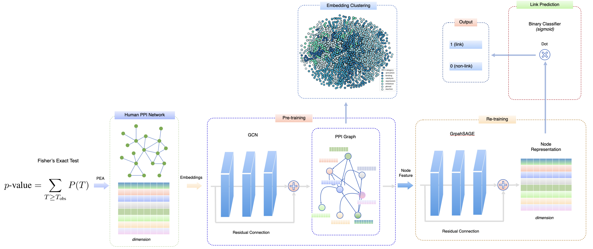

## Embedding-based protein-protein interaction prediction using graph neural networks

This repository contains the code for our paper,
"Embedding-based protein-protein interaction prediction using graph neural networks,"
submitted to the IEEE International Conference on Bioinformatics & Biomedicine (BIBM) 2025,
which will be held in Wuhan, China, on December 15-18, 2025.

You can learn more about the conference here:
[➡ IEEE BIBM 2025](https://biod.whu.edu.cn/bibm2025/)

## Data Source

The dataset is obtained from the following sources:

- **[STRING database](https://string-db.org/cgi/download?sessionId=b7WYyccF6G1p)**  
- **[SHS27k](https://pubmed.ncbi.nlm.nih.gov/31510705/)**  
- **[SHS148k](https://pubmed.ncbi.nlm.nih.gov/31510705/)** 

These databases provide curated and integrated protein-protein interaction (PPI) and pathway data for bioinformatics research.

## Setup and Get Started

1. Install the required dependencies:
   - `pip install -r requirements.txt`

2. Activate your Conda environment:
   - `conda activate gnn`

3. Install PyTorch:
   - `conda install pytorch torchvision torchaudio -c pytorch`

4. Install the necessary Python packages:
   - `pip install pandas`
   - `pip install py2neo pandas matplotlib scikit-learn`
   - `pip install tqdm`
   - `pip install seaborn`

5. Install DGL:
   - `conda install -c dglteam dgl`

6. Download the data from the built gene association graph using the link below and place it in the `data/multiomics_meth/` directory before training:
   - [Download Gene Association Data](https://drive.google.com/file/d/1l7mbTn2Nxsbc7LLLJzsT8y02scD23aWo/view?usp=sharing)

7. To train the model, run the following command:
   - `python ___link_prediction_gat_SHS27k_full/main.py --in-feats 256 --out-feats 128 --num-heads 2 --num-layers 2 --lr 0.001 --input-size 512 --hidden-size 16 --sampling_method random_neither_visible --model_type GAT --epochs 501`

